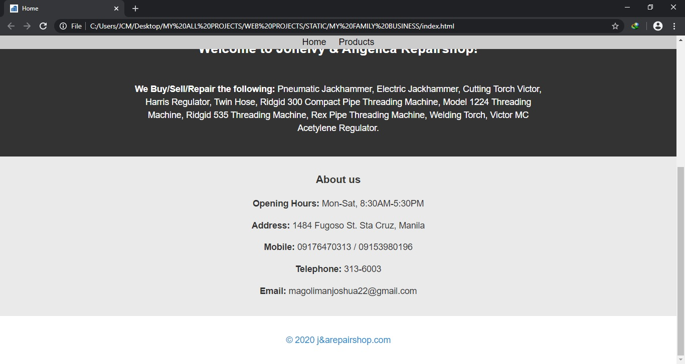

# MY FAMILY BUSINESS

* Purpose: My Project
* Front End: HTML5, SASS, CSS3
* Responsive Web Design: Yes
* Type of Website: Static

<h2> User Interface Screenshots </h2> 
  
  
  
  
  
  
  
  
  
  
  
	
  
	  
  
	
  
  
  <a href="https://naughty-wing-b628d3.netlify.app/index.html" target="_blank">CLICK HERE TO VISIT</a>
